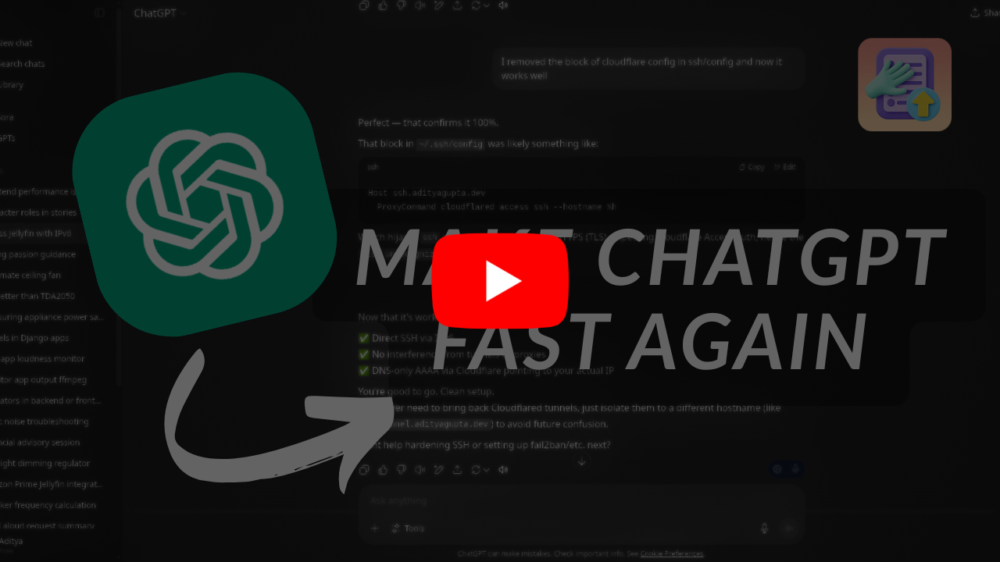

<h1 align="center">Gippity Pruner</h1>

<!-- Center align image -->

  

<h2 align="center">Fix ChatGPT in long conversations</h2>

ChatGPT tends to get really slow and unresponsive in long conversations. This extension prunes the conversation history to keep it responsive.

**This extension does not delete any messages, it just hides them from the chat view.**

Since ChatGPT still stores the full conversation history, you can still disable the extension and see all your messages, and also get the full context in your responses.

Here's a quick video showing how to install and use the extension:

---

## Installation

You can install the extension by first downloading the `.crx` file from the [Releases](https://github.com/sortedcord/gippity-pruner/releases/tag/v1.0.0.0) page, and then dragging it into the Chrome extensions page [chrome://extensions/](chrome://extensions/).

Make sure to enable "Developer mode" in the top right corner of the extensions page.

Once you have installed the extension, you can pin it to your toolbar for easy access. On clicking the icon, a menu will appear where you can select how many messages to keep in the conversation history and if you want to enable or disable the pruning feature.

## Usage

The pruning feature will activate once you reload the page. If you have disabled the pruning feature, you need to reload the page for the changes to take effect.

As of now, the extension is only available for chromium based browsers and is basic in functionality. But I hope to add more features in the future.

I guess, this is more of a response to openAI not fixing such a simple design flaw in their product - no lazy loading.

## Contributing

If you want to contribute to the project, feel free to open an issue or a pull request. Any contributions are welcome!

I expect this to break all the time, and I'll try to keep it updated as much as possible. If you find any bugs, please report them.

If you'd like more features, please open an issue and I'll try to implement them.
